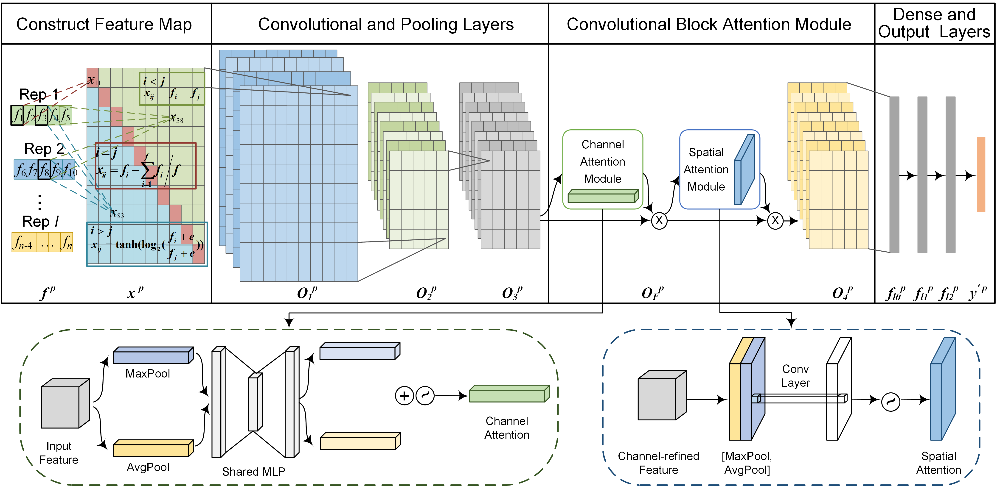
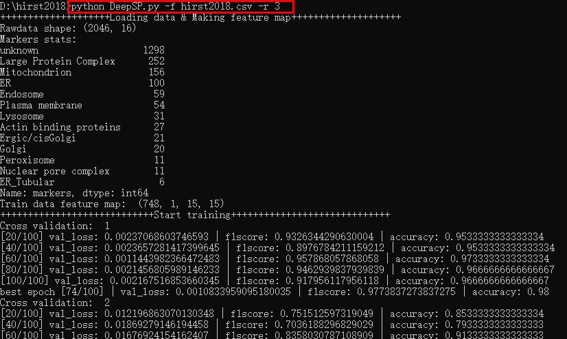

# DeepSP
DeepSP: A Deep Learning Framework for Spatial Proteomics


## DeepSP.py
DeepSP.py is is a python script that requires python software and some python modules to be installed.

DeepSP is a novel deep learning framework for PSL prediction in spatial proteomics, and its workflow is described in Figure 1. Firstly, the levels of each protein in different subcellular fractions are transformed into a feature map of difference matrix as input. Secondly, the feature map is processed by the CNN layers and the attention module to extract features. Lastly, the features are processed by the dense (full connected) and output layers with the focal loss to predict PSL.

## Install dependencies

The python modules that need to be installed are listed in requirements.txt, they can be installed via the command line interface as follows
```shell
$ pip install torch==1.13.1+cpu torchvision==0.14.1+cpu torchaudio==0.13.1 --extra-index-url https://download.pytorch.org/whl/cpu
$ pip install -r requirements.txt
```
If any python modules fail to install, you can install them one by one with the following command
```shell
$ pip install pandas==1.1.3
$ pip install numpy==1.19.2
$ pip install scikit-learn==0.23.2
$ pip install torch==1.13.1+cpu torchvision==0.14.1+cpu torchaudio==0.13.1 --extra-index-url https://download.pytorch.org/whl/cpu


## DeepSP help
The introduction of the DeepSP parameters can be achieved by naming them as follows

```shell
$ python DeepSP.py -h
usage: DeepSP.py [-h] [-f F] [-r R] [-p {Y,N}] [-n N] [-bs BS] [-s S] [-lr LR] [-l2 L2] [-eps EPS] [-nep NEP]

DeepSP for Protein Subcellular Localization Prediction

optional arguments:
  -h, --help            show this help message and exit
  -f F, --file F        file path, first column must be ProteinID, last column must be markers
  -r R, --rep R         number of repeated experiments
  -p {Y,N}, --getpred {Y,N}
                        whether to predict unknown proteins, default=Y
  -n N, --n_splits N    n-fold cross validation, default=5
  -bs BS, --batch_size BS
                        mini batch size, default=64
  -s S, -seed S         a random seed, default=0
  -lr LR, --learning_rate LR
                        learning rate, default=1e-3
  -l2 L2, --l2_regularization L2
                        l2 regularization, default=1e-4
  -eps EPS, --epochs EPS
                        training times, default=100
  -nep NEP, --nepoch NEP
                        print the results every * times, default=20
```


## Example file
hirst2018.csv
The file must be in csv format, the first column must be the protein number and there must be no duplicates, the last column must be the subcellular organelle to which the protein is localised, unknown localised proteins should be marked as unkonwn, the data in each row cannot be all zeros.


## DeepSP example
DeepSP.py can be run from the command line interface with the following commands, where -f (dataset file) and -r (the number of replicates) are the two required parameters.
An example command is “python DeepSP.py -f hirst2018.csv -r 3”, in which “-f” is input dataset file and “-r” is the number of replicates.
There is a running example in the example.jpg image。

```shell
$ python DeepSP.py -f hirst2018.csv -r 3
```


### Reference
Wang B, Zhang X, Xu C, Han X, Wang Y, Situ C, Li Y, Guo X. DeepSP: A Deep Learning Framework for Spatial Proteomics. J Proteome Res. 2023 Jul 7;22(7):2186-2198. doi: 10.1021/acs.jproteome.2c00394. 

If there are any problems, please contact me.
Bing Wang, E-mail: wangbing587@163.com
